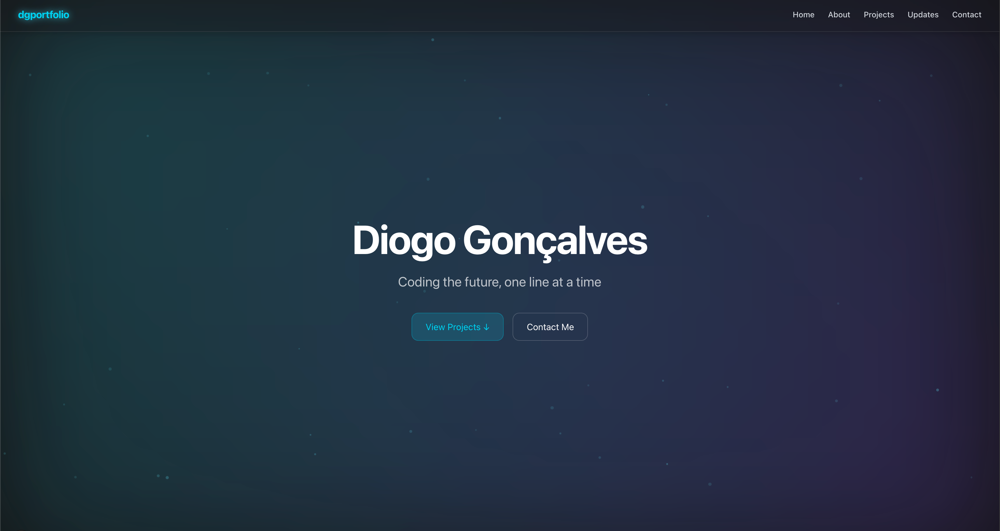

# Diogo Gonçalves – Portfolio

A responsive and interactive personal portfolio built with **Next.js 14**, **TypeScript**, and **Tailwind CSS**.  
Showcasing my projects, technologies, and professional journey as a **Full Stack Developer**.

---

## Overview

This website serves as my personal space to present who I am, what I’ve built, and what technologies I use.  
It features smooth animations, real-time GitHub updates, and an interactive design optimized for performance and accessibility.

**Live website:** [dgportfolio.pt](https://dgportfolio.pt)  
**Repository:** [GitHub – DCoelhoo/Portfolio-3.0](https://github.com/DCoelhoo/Portfolio-3.0)

---

## Tech Stack

Built using modern web technologies:

---

## Features

- About Me Section – Introduces my background, skills, and values  
- Projects Showcase – Displays personal and professional projects  
- Technologies Carousel – Continuously scrolling list of tools and frameworks I use  
- Updates Feed – Fetches and displays my latest GitHub commits and blog posts  
- Contact Form – Simple and secure Formspree integration  
- Animated Background – Parallax-based motion background with particles  

---

## Project Structure

- `app/`
  - `components/` → Reusable UI components (Navbar, Footer, Hero, etc.)
  - `api/` → Serverless functions (GitHub + Hashnode integrations)
  - `styles/` → Global CSS (Tailwind + custom styling)
  - `lib/` → Utility functions (e.g., GitHub token helper)
  - `page.tsx` → Home page

---

## Contact

If you’d like to collaborate or just get in touch, feel free to reach out:

	•	[LinkedIn](https://www.linkedin.com/in/diogocoelhogoncalves/)
	•	[Email](coelho.diogogoncalves@gmail.com)
	•	[Github](https://github.com/DCoelhoo)

---

## License

This project is open source and available under the [MIT License](LICENSE).

---

> “Coding the future, one line at a time.”